# RBAC System (Multi-tenant IAM)

A full-stack Identity & Access Management (IAM) project with multi-tenant RBAC, organisation switching, invitation flows, API keys, and email-based verification/password reset.

## Tech Stack

### Backend

- Node.js + Express
- Prisma ORM
- PostgreSQL
- Nodemailer email deliver

### Frontend

- Next.js (App Router)
- React + TypeScript
- Zustand for auth/session state
- Axios API client
- Tailwind CSS

---

## Usage Flow

### Home Page

Access the application home page:
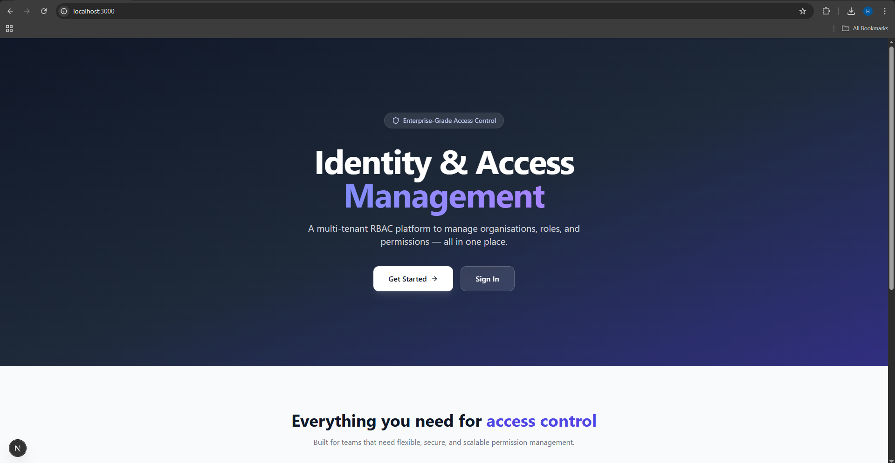

### User Registration

Register a new user and receive verification code:
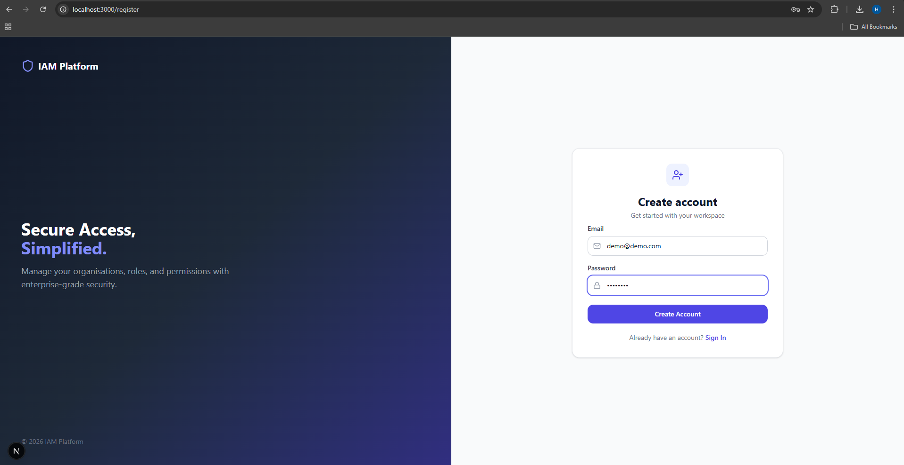
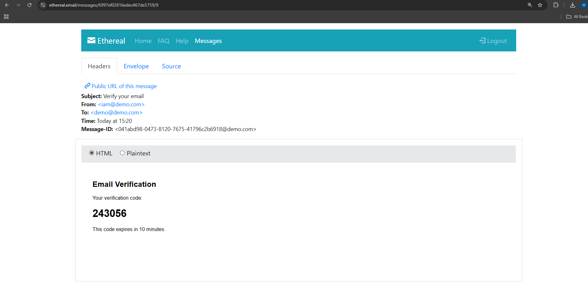

Verify email:
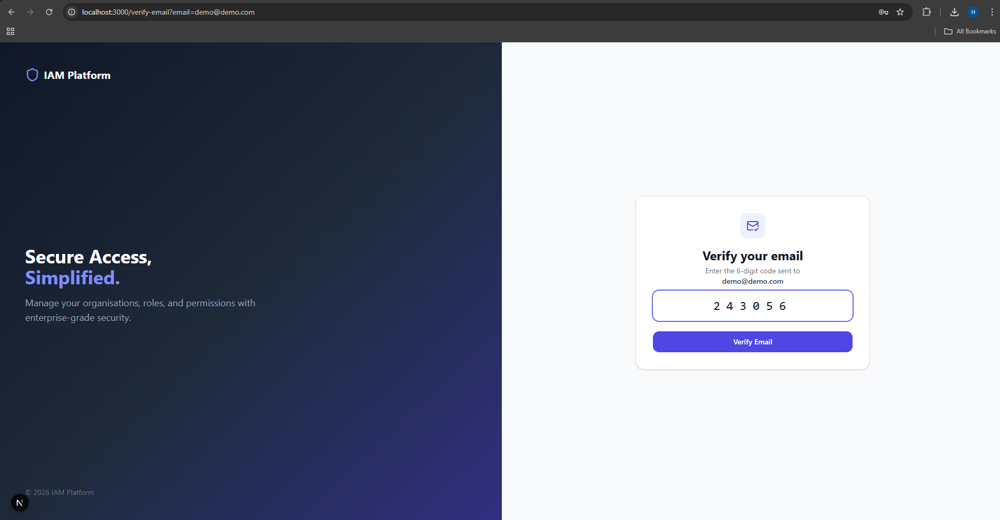

### Login

Login to access the dashboard:

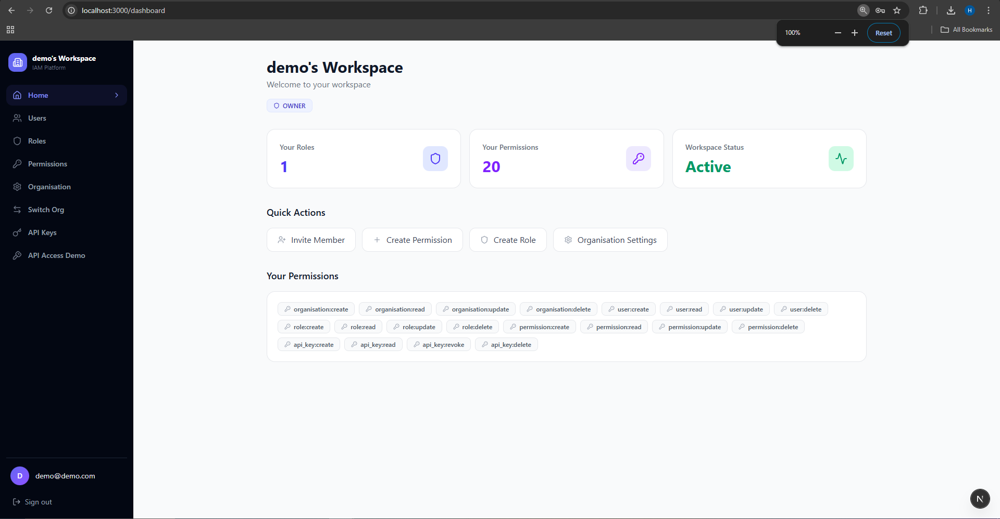

### Forgot Password

Recover password via OTP:
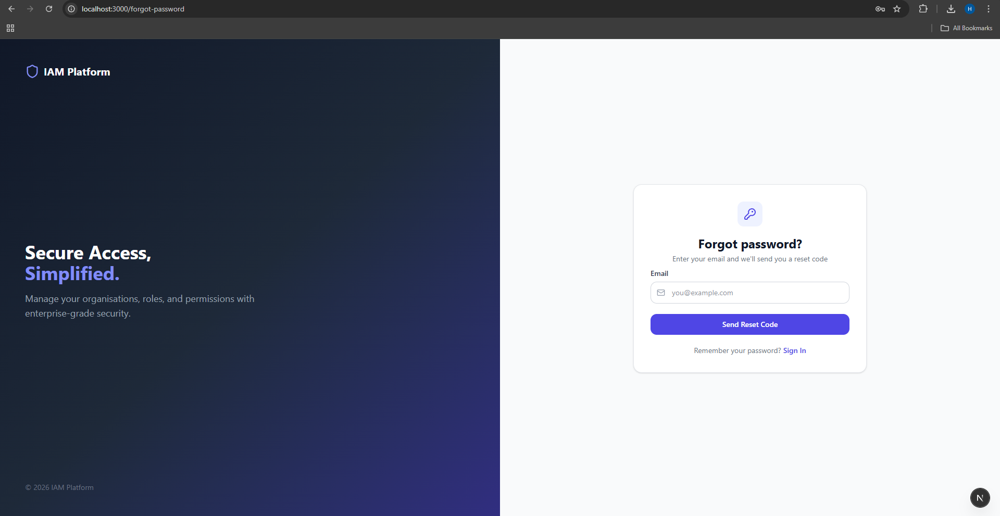
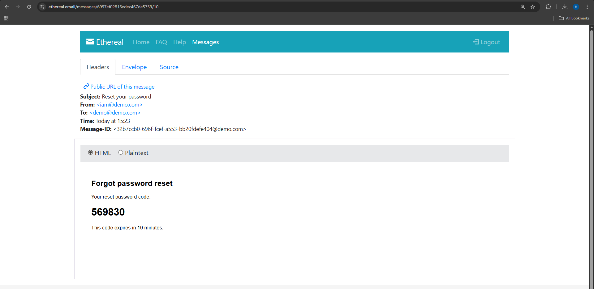


### Dashboard Overview

Home dashboard:
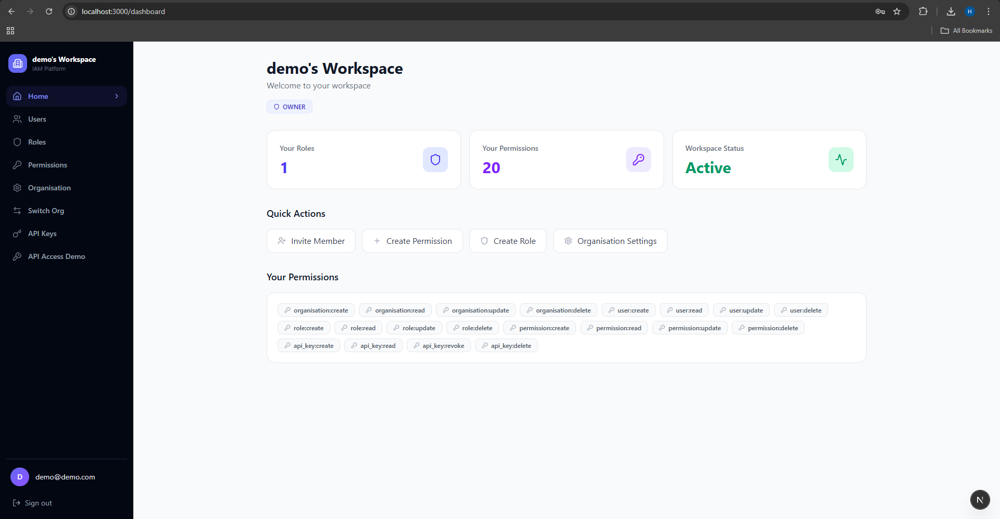

### Manage Users

User management page before and after adding a new user:
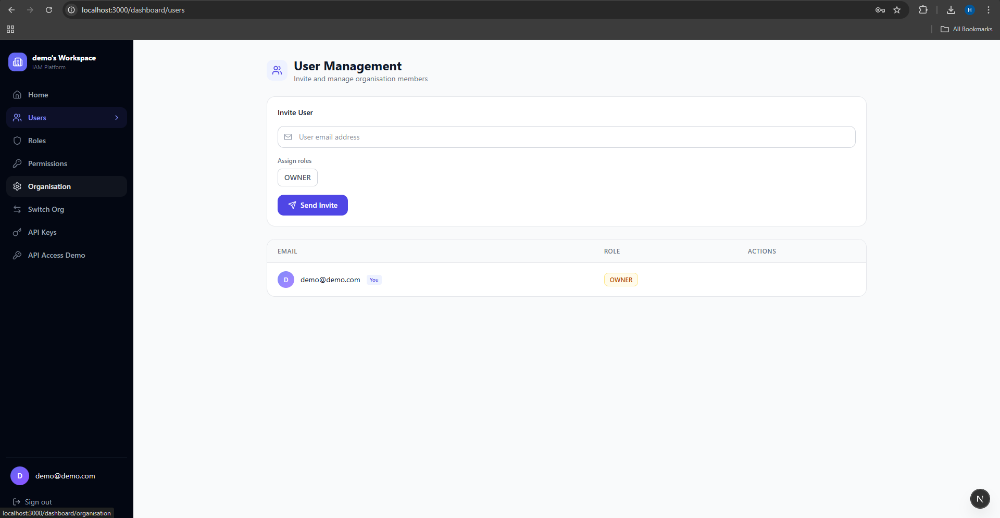
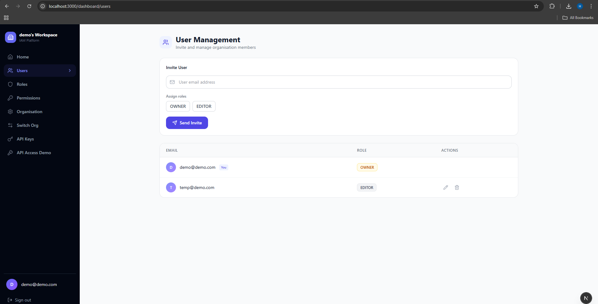

### Manage Roles

Role management page before and after creating a new role:
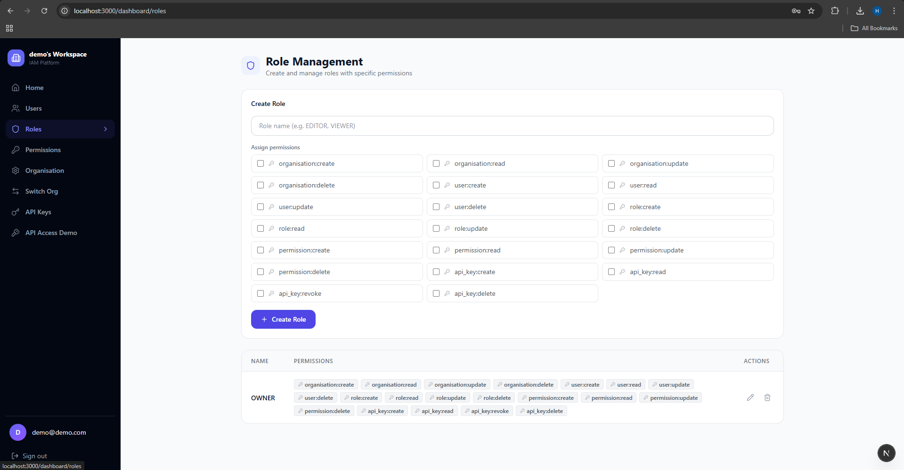
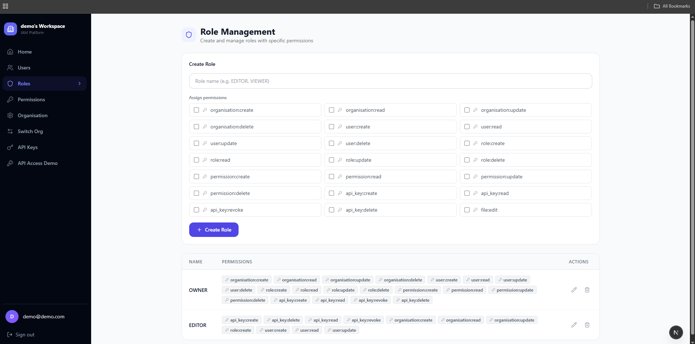

### Manage Permissions

Permissions page:
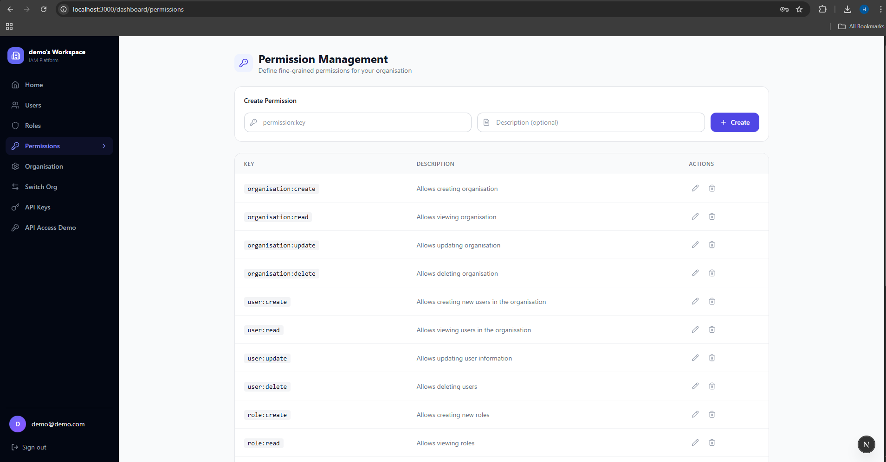

### Manage Organizations

Organizations page:
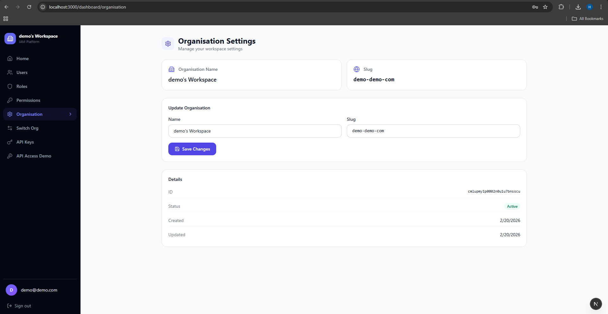

Switch organizations before and after creating a new one:
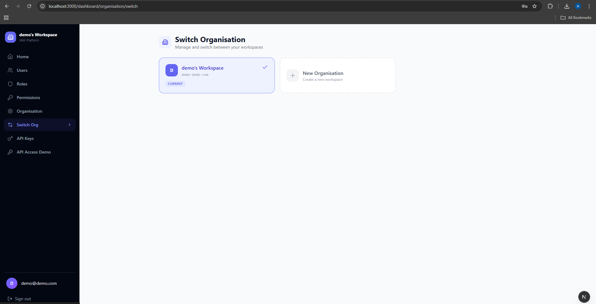
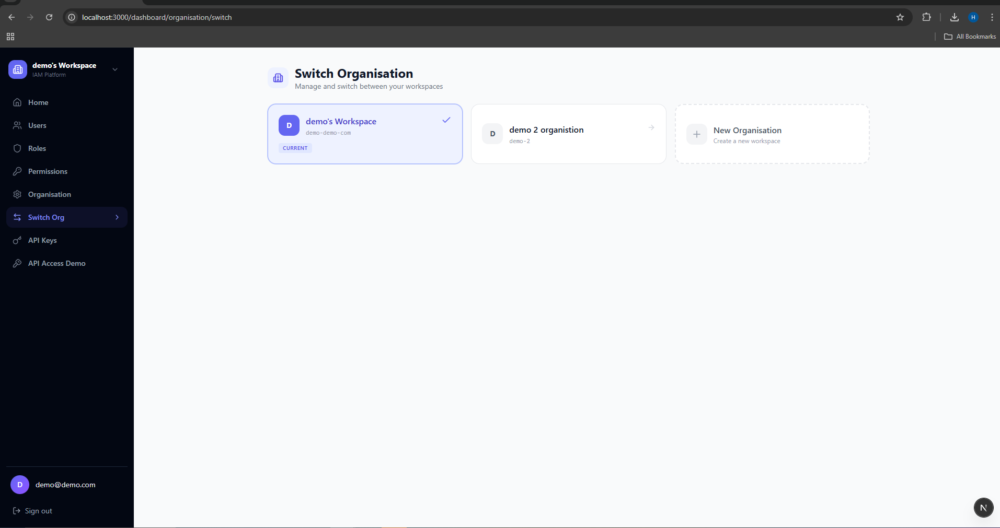

### API Keys

API key management before and after creating/revoking:
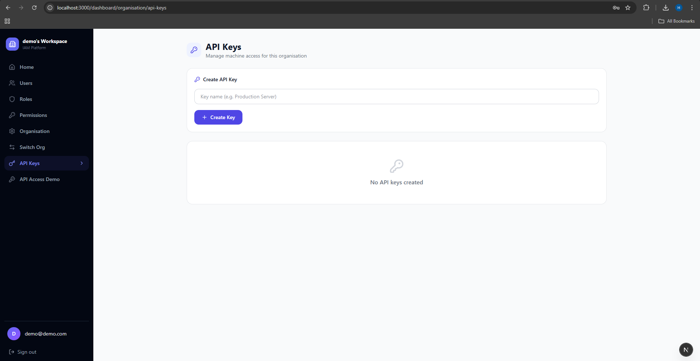
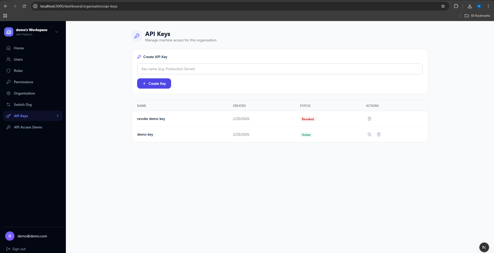

### API Access Demo

API access demo before and after entering a valid key:
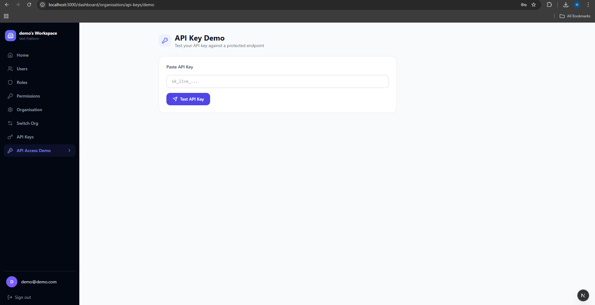
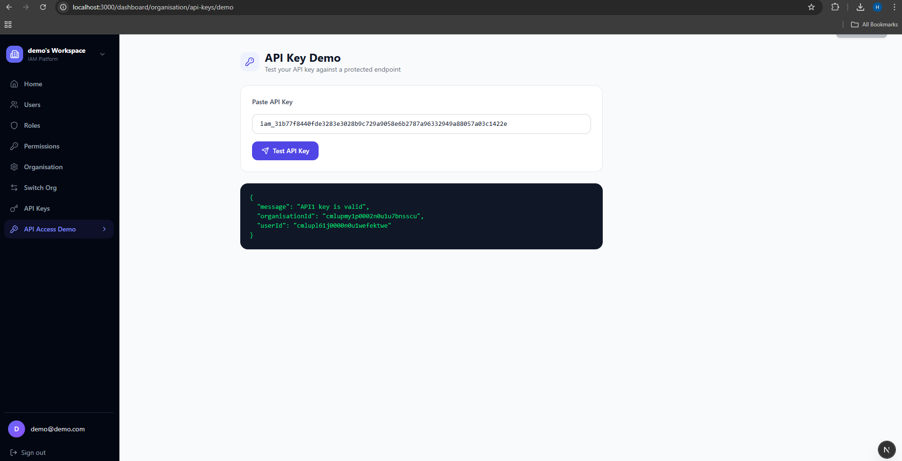

## Core Features

## 1) Authentication & Session Management

- User registration with email + password.
- Email verification flow before account activation.
- Login with JWT issuance.
- Session persistence in DB with revocation/expiry checks.
- Logout current session and logout-all sessions.
- Forgot-password flow with email token and password reset token verification.

## 2) Multi-Tenant Organisations

- Auto-create a personal workspace + OWNER role after first email verification.
- Create organisation manually (name + unique slug).
- Get current organisation details.
- List all organisations user belongs to.
- Update organisation name/slug.
- Delete organisation (owner-only, cascaded cleanup).
- Switch active organisation with refreshed token + org-scoped permissions.

## 3) RBAC (Roles & Permissions)

- Organisation-scoped roles.
- Organisation-scoped permissions.
- Role-permission mapping (many-to-many).
- Effective permission resolver for users with multiple memberships.
- Permission middleware guard (`requirePermission`) for protected routes.
- Default permission set bootstrapped for new organisations.

## 4) User & Membership Management

- List users in current organisation.
- Update a user’s roles (multi-role support).
- Prevent self-role modification.
- Enforce single OWNER guard.
- Remove user from organisation with OWNER safety checks.

## 5) Invite Flow

- Invite existing users to organisation with role IDs.
- Invite token creation + expiry.
- Accept invite endpoint to attach membership(s).
- Invite mail delivery includes frontend accept URL.

## 6) API Keys

- Create API keys (plaintext shown once).
- Store only hashed key in DB.
- List own keys.
- List all organisation keys (permission-protected).
- Revoke key.
- Delete key.
- API-key middleware for machine-to-machine auth.
- Demo endpoint for API-key validation testing.

## 7) Frontend Dashboard UX

- Auth pages: register, login, verify-email, forgot-password, reset-password.
- Protected dashboard with role/permission badges.
- Permission-gated actions and sections.
- Organisation settings UI.
- Organisation switch/create UI.
- Users, roles, permissions management pages.
- API keys management page + reveal modal + demo tester page.
- Automatic logout on 401 for authenticated requests.

---

## Project Structure

```bash
.
├── backend/
│   ├── prisma/
│   │   ├── schema.prisma
│   │   ├── migrations/
│   │   └── seed.js
│   └── src/
│       ├── auth/
│       ├── config/
│       ├── rbac/
│       ├── routes/
│       ├── service/
│       ├── utils/
│       ├── app.js
│       └── server.js
└── frontend/
    └── src/
        ├── app/
        ├── components/
        ├── hooks/
        ├── lib/api/
        ├── store/
        └── types/
```

---

## Data Model Highlights

### Main entities:

> This model supports multi-tenant role assignment, per-org permissions, invite onboarding, and API-key-based service access.

- User
- Session
- VerificationToken
- Organisation
- MemberShip
- Role
- Permission
- RolePermission
- OrganisationInvite
- ApiKey
- Subscription
- FeatureFlag

---

## API Overview (Backend)

### Base routing:

```text
/api/auth
/api/organisation
/api/users
/api/roles
/api/permissions
/api/invite
/api/keys
/api/demo
```

## Auth

```text
POST /api/auth/register
POST /api/auth/verify-email
POST /api/auth/login
POST /api/auth/logout
POST /api/auth/logout-all
POST /api/auth/forgot-password
POST /api/auth/reset-password-token
POST /api/auth/reset-password (authenticated)
```

## Organisation

```text
POST /api/organisation
GET /api/organisation
GET /api/organisation/all
PATCH /api/organisation
DELETE /api/organisation/:organisationId
POST /api/organisation/switch
```

## Roles

```text
POST /api/roles
GET /api/roles
PATCH /api/roles/:roleId
DELETE /api/roles/:roleId
```

## Permissions

```text
POST /api/permissions
GET /api/permissions
PATCH /api/permissions/:permissionId
DELETE /api/permissions/:permissionId
```

## Users

```text
GET /api/users
GET /api/users/me
PATCH /api/users/:userId
DELETE /api/users/:userId
```

## Invites

```text
POST /api/invite
POST /api/invite/accept
```

## API Keys

```text
POST /api/keys
GET /api/keys
GET /api/keys/all
PATCH /api/keys/:id/revoke
DELETE /api/keys/:id
```

## Demo

```text
GET /api/demo/access (API key auth)
```

---

## Environment Variables

### Backend (`backend/.env`)

- `PORT` (optional, defaults to 4000)
- `DATABASE_URL`
- `JWT_SECRET`
- `FRONTEND_URL`
- `MAIL_HOST`
- `MAIL_PORT`
- `MAIL_USER`
- `MAIL_PASS`
- `MAIL_FROM`

Backend `.env`:


### Frontend (`frontend/.env.local`)

- `NEXT_PUBLIC_BACKEND_BASE_URL` (e.g. `http://localhost:4000/api`)

Frontend `.env`:
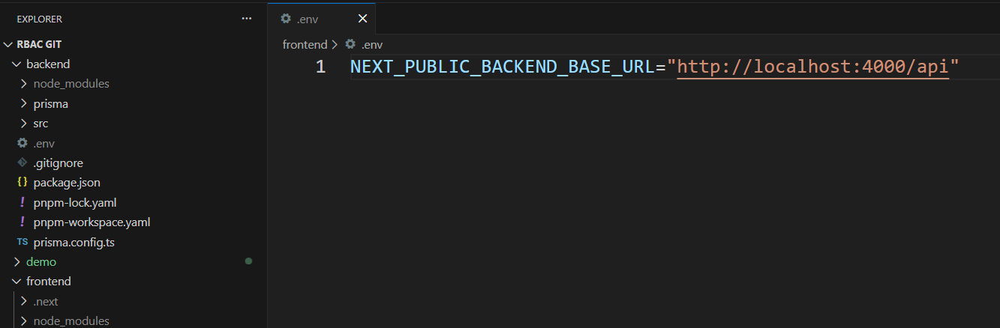

---

## Local Setup

### 1) Backend

```bash
cd backend
pnpm install
npx prisma migrate dev
npx prisma generate
# optional: node prisma/seed.js
pnpm dev
```

Start the backend:
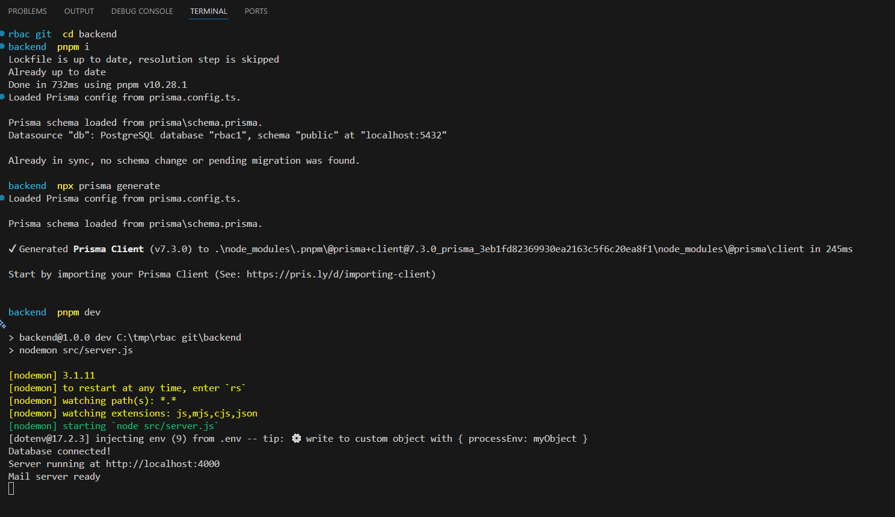

### 2) Frontend

```bash
cd frontend
pnpm install
pnpm dev
```

Start the frontend:
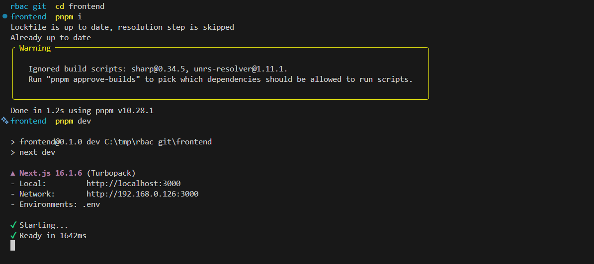

Frontend runs on `http://localhost:3000` and should point to backend API base URL.

---

## Notable Security Behaviors

- JWT requires active server-side session lookup.
- Session revocation and expiry enforced per request.
- Permission middleware enforces RBAC checks.
- API keys are hashed in storage (plaintext only returned once).
- Invite and verification flows use hashed token storage patterns.
- Auto client logout on 401 for authenticated requests.

---

## Current Default Permission Keys

```text
organisation:create
organisation:read
organisation:update
organisation:delete
user:create
user:read
user:update
user:delete
role:create
role:read
role:update
role:delete
permission:create
permission:read
permission:update
permission:delete
api_key:create
api_key:read
api_key:revoke
api_key:delete
```
